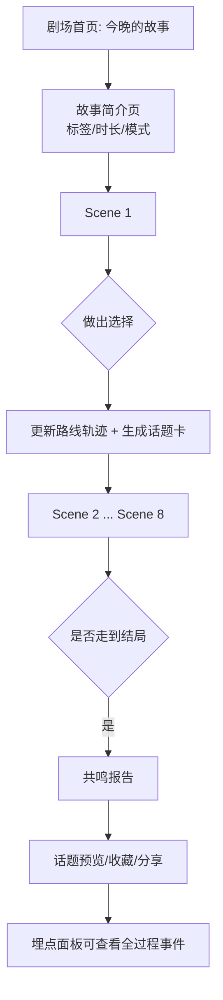
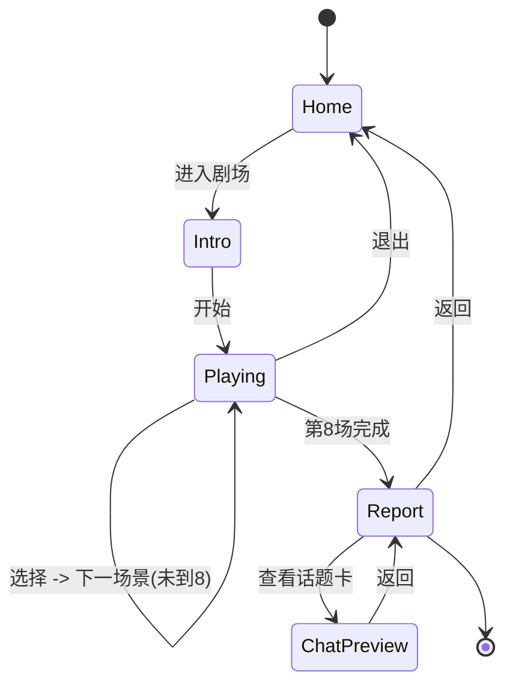

# 共鸣剧场 · 产品需求文档（PRD）

> 嵌入 Soul App 的日更沉浸式互动剧。本期定位：**内容 / 情绪价值优先**——把它当作一个"每晚可追"的互动叙事 IP 来做，而不是单纯的破冰工具。
> 本期目标产物：**可点击交互原型（Demo）**，不接真实社交后端。

| 项 | 内容 |
|---|---|
| 文档版本 | v0.1（待评审） |
| 状态 | Draft |
| 定位选择 | 内容/情绪价值优先 |
| 本期范围 | 可点击交互原型（前端 Demo，纯本地数据） |
| 首个样板剧本 | 《凌晨 2:17 的小票》（不打烊便利店） |
| 单局时长 | ~5 分钟 / 8 个场景 |

---

## 0. 执行约束（遵循 Karpathy Guidelines）

本 PRD 按“先想清楚、保持简单、只做必要改动、结果可验证”的原则收敛。

### 0.1 当前假设
- 用户当前要的是**产品方案 + 可点击原型方向**，不是上线级工程实现。
- 第一版原型只用于内部体验、讨论和演示，不接 Soul 真实账号、匹配、聊天、支付或风控系统。
- 内容方向已确定为**内容/情绪价值优先**，因此本期不把“真实发话转化”作为唯一目标。
- 技术栈暂未确认；在未确认前，PRD 只定义产品和状态，不指定具体框架实现细节。

### 0.2 最小成功标准
- 用户能从首页进入《凌晨 2:17 的小票》，连续完成 8 个场景。
- 每个场景只有 1 次关键选择，选择会更新进度、路线轨迹和最终报告。
- 通关后展示共鸣报告，报告能清楚解释“为什么我是这个结果”。
- 至少 3 张话题卡可进入聊天预览，但不发送真实消息。
- 埋点面板能看到 `story_start`、`scene_complete`、`report_show`、`topic_card_open` 等关键事件。

### 0.3 本期刻意不做
- 不做多结局复杂分支，只做**轻分支、主线收敛**。
- 不做真实社交链路，不对接私信、匹配、推荐或好友关系。
- 不做商业化、隐藏付费结局、会员权益或支付流程。
- 不做后台 CMS、AI 生成后台、UGC 剧本平台。
- 不做过度抽象的数据引擎；只保留足够支撑一个剧本原型的 JSON 结构。

---

## 1. 背景与目标

### 1.1 背景
Soul 是 AI+沉浸式社交平台，Z 世代为主，日均使用 50+ 分钟，核心收入来自"情绪价值"（虚拟道具+会员，占比 90%+），并自研情绪价值大模型 Soul X。平台原有的"灵魂鉴定/MBTI 测试"是一次性的、静态的；用户做完即走。

**共鸣剧场**把"做测试"升级为"每晚追一个沉浸式互动故事"：有情绪曲线、有选择、有"我的专属轨迹"，天然适合睡前碎片时间。本期先验证一个故事是否足够成立。

### 1.2 本期目标（内容优先）
- **验证内容吸引力**：用户是否愿意玩完一整局（完成率），是否愿意第二天再来（次日留存意愿）。
- **验证情绪价值**：用户对剧情、氛围、结局报告是否有情感共鸣（体验后主观反馈）。
- **跑通可点击原型**：把《凌晨 2:17 的小票》完整 8 场景、轻分支、轨迹、共鸣报告、话题预览、埋点面板用前端 Demo 实现，供内部体验与对外演示。

### 1.3 验收标准
- 从首页开始，3 分钟内能完整体验一轮主流程，不出现断点。
- 原型里每个按钮都有明确反馈：进入、选择、下一场、查看报告、打开话题卡、查看埋点。
- 共鸣报告使用用户实际选择生成，不是固定文案。
- 原型不依赖后端服务；断网情况下仍可演示。
- 代码实现时，每个新增文件都能直接对应到上述原型目标，避免“以后可能会用”的抽象。

### 1.4 非目标（本期不做）
- 不接真实匹配/真实私信后端（话题卡仅做"模拟进入聊天"的预览效果）。
- 不做多人/双人同步。
- 不做真实商业化支付，也不做隐藏付费结局展示。
- 不做后台内容管理系统（剧本以本地 JSON 静态文件提供）。

---

## 2. 设计原则

1. **氛围 > 玩法复杂度**：靠文案、节奏、视觉氛围（雨夜/便利店/暖光）建立沉浸，不堆复杂交互。
2. **5 分钟可完成**：8 场景、每场 1 次关键选择，绝不冗长。
3. **"我的故事独一无二"**：用"路线轨迹"可视化让用户感到选择有意义。
4. **选择即性格**：每个选项暗含性格维度标签，结局生成"共鸣报告"。
5. **温柔不擦边**：深夜情感题材，文案克制、治愈向，规避敏感内容（见第 11 节合规）。
6. **先验证一个故事**：本期只把《凌晨 2:17 的小票》打磨顺滑，不提前建设通用内容平台。

---

## 3. 目标用户与场景

- **用户画像**：18–26 岁、夜间活跃、慢热、愿意深聊一点点、喜欢治愈/轻喜剧/微悬疑氛围的 Soul 用户。
- **典型场景**：晚上 23:00–02:00 躺床上，打开 Soul，看到"今晚的故事"推送，花 5 分钟玩一局，得到一份情绪报告。

---

## 4. 核心概念与名词

| 名词 | 定义 |
|---|---|
| 剧场（Theater） | 功能总入口，每日推一个故事 |
| 故事/剧本（Story） | 一个完整叙事单元，含 N 个场景 |
| 场景（Scene） | 剧本的最小推进单位，含旁白 + 1 组选择，本样板共 8 个 |
| 选择（Choice） | 场景中的分支选项，携带性格维度权重与可能的话题卡 |
| 路线轨迹（Route Track） | 玩家已走过的选择路径可视化 |
| 共鸣报告（Resonance Report） | 通关后基于选择生成的性格/情绪画像 |
| 话题卡（Topic Card） | 由剧情/选择生成的破冰开场白，可"进入聊天预览" |
| 标签（Tags） | 故事氛围 + 玩家倾向标签（如：夜间活跃·慢热·愿意深聊；轻喜剧·中等互动） |
| 埋点日志（Tracking Log） | 模拟记录关键事件，原型内可视化展示 |

---

## 5. 玩法总览

### 5.1 主流程图



### 5.2 单场景的交互节拍
1. 进入场景：氛围背景 + 旁白文字（可逐句淡入，营造节奏）。
2. 呈现 1 组选择（2–3 个）。
3. 玩家点选 → 选项反馈文案 → 更新"路线轨迹" + 可能掉落一张"话题卡"。
4. 推进到下一场景（顶部进度 X/8 更新）。

---

## 6. 功能模块详述

### 6.1 剧场首页（今晚的故事）
- 展示"今晚故事"卡片：标题《凌晨 2:17 的小票》、场景名"不打烊便利店"、封面氛围图、标签行、时长（5 分钟）、模式（雨夜进店）、进度（1/8 或"未开始"）。
- 主按钮："进入剧场"。
- 本期不做往期故事入口，避免为未验证内容提前设计导航。

### 6.2 故事简介页
- 标题 + 副标题 + 氛围标签（两组：氛围标签 / 玩家倾向标签）。
- 一句话引子。
- "开始"按钮。

### 6.3 场景播放器（核心）
- 顶部：进度条 X/8、退出按钮、模式标识。
- 中部：氛围背景 + 旁白文本区（支持逐句出现）。
- 底部：选择按钮组（2–3 个）。
- 选择后：短反馈文案 + 自动/点击进入下一场景。

**样板剧本《凌晨 2:17 的小票》8 场景骨架**（文案为占位/可迭代）：

| # | 场景名 | 旁白要点 | 选择（示例） |
|---|---|---|---|
| 1 | 门铃响了三次 | 雨停，2:17，便利店招牌亮起，无人收银，小票机吐出"请替陌生人把没送出的话带到天亮前" | 先看小票任务 / 轻声叫店员 / 回头确认门还开着 |
| 2 | 没有价格的小票 | 小票上是一段未写完的话 | 读完它 / 先找线索 / 放回去 |
| 3 | 第二位访客 | 门铃又响，进来一个同样困惑的人 | 主动搭话 / 默默观察 / 给对方递杯热饮 |
| 4 | 货架之间 | 在货架找到与小票相关的物件 | 拿起 / 拍照记下 / 不碰 |
| 5 | 收音机里的声音 | 一段旧广播提到"未送达" | 调大音量 / 关掉它 / 跟着哼 |
| 6 | 该替谁带话 | 需要决定把话带给谁 | 带给等待的人 / 带给写话的人 / 留给自己 |
| 7 | 天快亮了 | 时间逼近，必须做最后决定 | 写下回信 / 打个电话 / 沉默地离开 |
| 8 | 门铃第四次 | 收束：你完成了"带话"，门重新打开 | 留下名字 / 不留痕迹 / 约定再来 |

> 注：本期为可点击原型，分支可做"轻分支"——选择影响轨迹文案、话题卡、报告权重，但 8 个场景的主线收敛（降低内容量与开发量）。

### 6.4 路线轨迹
- 以时间线/足迹形式展示玩家每一场的选择标题。
- 文案随选择变化（如"雨刚停，第一张小票还没被读完"）。
- 作用：制造"独一无二"的仪式感。

### 6.5 共鸣报告（通关结算）
- 基于各选项的性格维度权重，输出：
  - **今晚的你**：3–5 个关键词（如：守序的探索者 / 慢热但温柔 / 愿意为陌生人停留）。
  - **情绪关键词**：1–2 个（如：治愈、微怅然）。
  - **倾向标签**：夜间活跃·慢热·愿意深聊（对齐匹配维度，本期仅展示）。
  - **路线小结**：一段总结你这条线的文案。
- 操作：查看话题卡、返回首页、查看埋点日志。

性格维度建议（每个选项打分，结算时归一化）：
- 行动取向：任务导向 ↔ 关系导向
- 探索风格：先找规则 ↔ 先找人
- 安全需求：高 ↔ 低
- 表达倾向：含蓄 ↔ 直接
- 情感温度：克制 ↔ 热忱

### 6.6 话题卡 / 聊天预览
- 玩家在剧情中点选话题，或在报告页选择话题卡。
- 点击后进入"聊天预览"：像真实开场白一样以气泡形式展示（如"你也在便利店遇到过 2:17 吗？"）。
- 本期为**预览态**：仅模拟"发送进聊天"的视觉效果，不接真实私信。
- 文案来源：剧本预置 + 选择关联。

### 6.7 埋点日志面板
- 原型内可视化展示已触发的事件流（见第 9 节字段）。
- 入口："查看埋点"。以列表/时间线展示，便于演示数据漏斗。

---

## 7. 页面与信息架构

```
剧场首页（今晚的故事）
 ├─ 故事简介页
 │   └─ 场景播放器（Scene 1..8）
 │        ├─ 选择反馈
 │        ├─ 路线轨迹（侧栏/可展开）
 │        └─ 话题卡掉落 → 聊天预览
 ├─ 共鸣报告页
 │   └─ 话题预览
 └─ 埋点日志面板
```

页面清单（原型需实现）：
1. 剧场首页
2. 故事简介页
3. 场景播放器（含进度、旁白、选择、轨迹、话题预览）
4. 共鸣报告页
5. 聊天预览（弹层/页）
6. 埋点日志面板（弹层/页）

---

## 8. 状态机



关键状态数据（前端本地维护）：
- `currentSceneIndex`（0–7）
- `choices[]`（每场所选 choiceId）
- `routeTrack[]`（轨迹文案）
- `topicCards[]`（已获得话题卡）
- `personalityScores{}`（维度累计分）
- `eventLog[]`（埋点事件）

---

## 9. 埋点字段（原型模拟）

核心漏斗：进入剧场 → 完成各节点 → 看报告 → 看/选话题卡。

| 事件名 | 触发时机 | 关键字段 |
|---|---|---|
| `theater_enter` | 进入剧场首页 | storyId, source, ts |
| `story_start` | 点击开始 | storyId, ts |
| `scene_complete` | 完成一个场景 | storyId, sceneIndex, choiceId, ts |
| `topic_card_get` | 掉落话题卡 | storyId, sceneIndex, cardId |
| `topic_card_open` | 查看话题卡/聊天预览 | cardId |
| `report_show` | 展示共鸣报告 | storyId, personalityTags[], emotionTags[] |
| `report_action` | 返回首页/查看埋点 | actionType |
| `story_exit` | 中途退出 | storyId, sceneIndex |

原型阶段：以上事件写入本地 `eventLog[]`，在埋点面板可视化。

---

## 10. 内容数据模型（剧本 JSON Schema）

便于原型直接读取。后续若要扩展到 AI 生成或后台配置，再基于真实需求调整，不在本期实现。

```json
{
  "storyId": "store_0217",
  "title": "凌晨2:17的小票",
  "scene": "不打烊便利店",
  "mode": "雨夜进店",
  "durationMin": 5,
  "ambianceTags": ["轻喜剧", "中等互动", "轻松深聊"],
  "tendencyTags": ["夜间活跃", "慢热", "愿意深聊一点点"],
  "intro": "雨停在街灯下面，手机时间停在2:17……",
  "scenes": [
    {
      "index": 0,
      "name": "门铃响了三次",
      "narration": ["雨里亮起的便利店……", "小票机慢慢吐出一张没有价格的小票。"],
      "routeText": "雨刚停，第一张小票还没被读完。",
      "choices": [
        {
          "id": "s0_c1",
          "label": "先看小票任务，先别乱猜",
          "feedback": "你把小票凑近暖光，字迹有点温度。",
          "scores": {"action": 1, "explore_rule": 1, "safety": 0},
          "topicCard": {"id": "card_s0_c1", "text": "你也在便利店遇到过2:17吗？"}
        },
        {
          "id": "s0_c2",
          "label": "轻声叫店员，先确认有没有人在",
          "feedback": "没人回应，只有制冷机的低鸣。",
          "scores": {"relation": 1, "explore_people": 1, "safety": 1}
        },
        {
          "id": "s0_c3",
          "label": "回头确认门还开着，安全感先到位",
          "feedback": "门虚掩着，雨味钻进来。",
          "scores": {"safety": 2, "action": 0}
        }
      ]
    }
  ],
  "report": {
    "dimensions": ["action", "relation", "explore_rule", "explore_people", "safety", "warmth"],
    "templates": [
      {"if": "safety>=2", "keyword": "稳稳的安全感型"},
      {"if": "relation>=2", "keyword": "为陌生人停留的人"}
    ]
  }
}
```

---

## 11. 风险与合规

| 风险 | 说明 | 应对 |
|---|---|---|
| 内容衰减 | 互动剧"玩一次就腻" | 本期先验证单个故事是否足够吸引；不提前建设日更系统 |
| 深夜情感擦边 | 便利店/陌生人/深夜易触敏感线 | 文案治愈克制；建立敏感词与题材清单；AI 生成内容人工审核 |
| 转化断点 | 玩得开心≠愿意真去发私信 | 本期先验证内容；话题卡设计降低发话门槛 |
| 与现有灵魂测试重叠 | 定位冲突 | 明确为"动态版/内容化"补充，差异化运营 |

---

## 12. 本期范围（可点击原型）与后续路线

### 本期（Demo）必做
- 6 个页面/弹层全部可点击跑通。
- 《凌晨 2:17 的小票》完整 8 场景 + 轻分支。
- 路线轨迹、共鸣报告、话题卡聊天预览、埋点面板。
- 剧本以本地 JSON 驱动，便于替换。

### 后续版本（仅作为方向，不在本期预留复杂接口）
- 真实匹配/私信对接（话题卡真正发出）。
- 双人同步剧场（破冰壁垒）。
- 剧场派对房（多人投票，复用群聊派对+礼物）。
- UGC 剧本生态 + Soul X 自动日更。
- 商业化：支线解锁、深度报告、联名 IP（米哈游）。

---

## 13. 待确认问题（Open Questions）
1. 原型用什么技术栈？（建议：纯前端 React/Vite 单页，便于演示与移动端预览）
2. 视觉氛围方向：写实暖光便利店 vs 插画/像素风？
3. 分支深度：本期是否接受"轻分支主线收敛"（推荐），还是要真多结局？
4. 是否需要为 Demo 配一套占位封面/氛围图（可用 AI 生成）？
