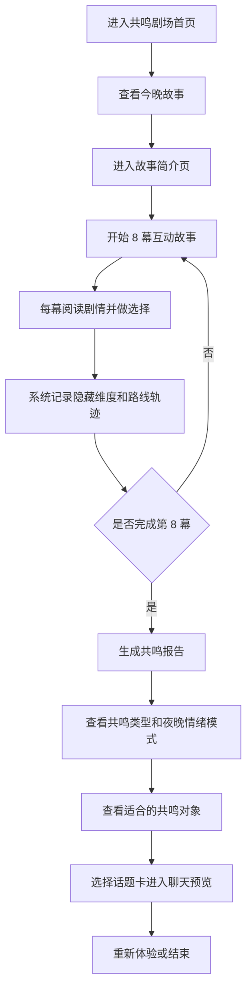

# 共鸣剧场需求文档

| 文档项 | 内容 |
|---|---|
| 项目名称 | 共鸣剧场：凌晨 2:17 的小票 |
| 所属产品 | Soul App |
| 文档版本 | v1.0 |
| 核心定位 | 通过沉浸式互动游戏帮助用户认识自己，并生成共鸣报告 |
| 首个故事 | 《凌晨 2:17 的小票》 |
| 单局时长 | 约 5 分钟 |
| 场景数量 | 8 幕 |

---

## 0. 创意闪念

### 0.1 创意来源

年轻人常常在夜晚更容易感到孤独、敏感和想表达，但真正打开聊天框时，又会因为怕打扰、怕太认真、怕没人接住而把话删掉。Soul 本身强调“灵魂共鸣”和低压力社交，因此可以把传统人格测试改造成一个更有氛围的互动故事：用户不是填问卷，而是在凌晨 2:17 的不打烊便利店里，通过一次次选择看见自己的情绪习惯。

### 0.2 解决了什么问题

- 解决传统测试“像答题、不沉浸”的问题，让用户通过游戏自然认识自己。
- 解决夜晚用户有表达欲但不敢直接聊天的问题，先用故事承接情绪。
- 解决陌生人社交缺少自然开场的问题，通关后生成可直接用于聊天的话题卡。
- 解决内容体验和社交转化割裂的问题，让“玩故事 → 得报告 → 开始聊天”形成闭环。

### 0.3 核心玩法

用户进入《凌晨 2:17 的小票》，在 8 幕夜晚便利店剧情中做选择。每个选择都对应一种隐藏情绪维度，例如安全感、表达方式、关系倾向、行动倾向和温度感。游戏过程不展示分数，保持沉浸；通关后系统生成共鸣类型、夜晚情绪模式、关系习惯、给自己的小票、适合的共鸣对象和聊天话题卡。

### 0.4 预期价值

- 对用户：获得一种温柔、低压力、好分享的自我认知体验。
- 对社交：把用户的故事选择转化为自然破冰话题，降低开聊门槛。
- 对内容：形成可日更、可系列化的夜间互动故事栏目。
- 对产品：提升夜间停留、通关率、报告分享率和聊天转化，为 Soul 的情绪价值服务增加新入口。

---

## 1. 项目概述

### 1.1 项目一句话

共鸣剧场是一款嵌入 Soul 的沉浸式互动叙事游戏，用户通过夜晚故事中的选择认识自己的情绪表达方式、关系习惯和安全感来源，最终生成类似 MBTI 的共鸣报告，并获得可用于社交破冰的话题。

### 1.2 项目背景

Soul 的核心价值是帮助年轻人找到精神共鸣和低压力社交关系。传统性格测试虽然能提供自我认知结果，但常常像问卷，代入感弱、完成后缺少社交延展。

共鸣剧场尝试把“性格测试”包装成“互动故事”：用户不是回答题目，而是在一个有氛围的夜晚故事中做选择。系统根据选择生成隐藏维度、共鸣类型、夜晚情绪模式、关系习惯和聊天开场白，让用户在游戏中自然完成自我识别。

### 1.3 本期目标

- 验证“通过游戏认识自己”的体验是否成立。
- 验证用户是否愿意完成 8 幕互动故事。
- 验证共鸣报告是否能带来“被理解”的感觉。
- 验证报告中的话题卡是否适合作为聊天破冰入口。

---

## 2. 解决的问题

### 2.1 用户问题

- 年轻用户夜晚情绪更敏感，有表达欲，但不一定愿意直接聊天。
- 用户想认识自己，但传统测试太像答题，缺少沉浸感。
- 慢热用户需要一个低压力入口，先通过故事靠近自己的情绪，再决定是否社交。
- 陌生人社交容易尴尬，缺少自然、有内容、有情绪温度的开场白。

### 2.2 产品问题

- 传统灵魂测试偏静态，复玩动力有限。
- 内容消费和社交转化之间缺少柔性连接。
- 用户完成测试后，如果没有可分享、可讨论、可聊天的结果，价值容易中断。

### 2.3 本项目解法

用“互动叙事 + 隐藏测试 + 共鸣报告 + 话题卡”的方式，把测试过程游戏化，把报告结果社交化。

---

## 3. 用户故事

### 3.1 核心用户故事

作为一名夜晚情绪敏感、慢热但渴望被理解的 Soul 用户，我希望通过一个轻量、有氛围的互动故事，安全地靠近自己的真实想法，并在结束后获得一份像 MBTI 一样好懂、好分享的共鸣报告。

### 3.2 具体用户故事

#### 用户故事 1：夜晚自我认知

作为一个深夜容易想很多的人，我想进入一个不会催我表达的故事，通过选择慢慢看见自己的情绪模式。

#### 用户故事 2：轻量测试

作为一个不喜欢填问卷的人，我想通过游戏完成测试，而不是直接回答“你是什么性格”。

#### 用户故事 3：获得共鸣报告

作为一个喜欢看 MBTI、星座、人格标签的用户，我想在故事结束后得到一个属于我的共鸣类型，并能理解它和我的选择有关。

#### 用户故事 4：社交破冰

作为一个慢热用户，我想获得几句自然、不尴尬的开场白，用来和可能共鸣的人开始聊天。

---

## 4. 核心玩法

### 4.1 玩法概述

用户进入《凌晨 2:17 的小票》故事，在“不打烊便利店”中经历 8 幕剧情。每一幕给出一个情境和 3 个选择。用户做出的选择会影响隐藏维度分数，最终生成共鸣报告。

### 4.2 玩法原则

- 不直接问“你是什么样的人”，而是让用户在故事中自然投射。
- 每个选择都没有对错，只代表不同情绪处理方式。
- 游戏过程不展示测试分数，避免打断沉浸。
- 报告页展示用户能理解、能分享、能用于聊天的结果。

### 4.3 8 幕场景设计

| 场景 | 场景名 | 设计目的 | 测试维度 |
|---|---|---|---|
| Scene 1 | 门铃响了三次 | 面对未知时的第一反应 | 规则 / 关系 / 安全感 |
| Scene 2 | 没有价格的小票 | 面对没说出口的话如何处理 | 表达 / 照顾 / 观望 |
| Scene 3 | 第二位访客 | 面对相似情绪的人如何靠近 | 主动 / 观察 / 安慰 |
| Scene 4 | 草稿箱货架 | 面对未发送消息与秘密如何选择 | 含蓄 / 规则 / 边界 |
| Scene 5 | 收音机里的声音 | 面对未送达留言如何承接 | 直接 / 暂停 / 陪伴 |
| Scene 6 | 该替谁带话 | 面对遗憾和关系选择如何决策 | 送达 / 归还 / 不替人决定 |
| Scene 7 | 天快亮了 | 面对自己最需要的话 | 自我鼓励 / 允许沉默 / 明天再开始 |
| Scene 8 | 门铃第四次 | 离开故事时如何安放自己 | 留名 / 收藏 / 约定 |

---

## 5. 核心流程



---

## 6. 功能需求

### 6.1 剧场首页

展示今晚故事信息，吸引用户进入。

页面内容：

- 项目名称：Soul · 共鸣剧场 Demo
- 故事标题：《凌晨 2:17 的小票》
- 场景：不打烊便利店
- 标签：夜间活跃、慢热、愿意深聊一点点、轻喜剧、中等互动、轻松深聊
- 时长：5 分钟
- 模式：雨夜进店
- 按钮：进入剧场

验收标准：

- 用户能从首页进入故事简介页。
- 首页不展示埋点、测试分数等后台信息。

### 6.2 故事简介页

介绍故事氛围和体验目标，让用户知道这是一次故事化体验。

页面内容：

- 故事标题
- 故事简介
- 标签
- 体验目标
- 开始按钮

验收标准：

- 用户点击“开始”后进入 Scene 1。
- 页面文案保持轻量，不出现过强测试感。

### 6.3 场景播放器

承载 8 幕互动剧情，每幕展示旁白和 3 个选择。

页面内容：

- 当前进度：Scene X/8
- 场景名
- 剧情旁白
- 选择按钮
- 选择后反馈
- 路线轨迹

交互规则：

- 用户每幕只能选择一次。
- 选择后展示剧情反馈。
- 点击“进入下一幕”后推进剧情。
- 第 8 幕完成后进入共鸣报告。

验收标准：

- 8 幕流程能完整跑通。
- 每个选择都会记录到路线轨迹。
- 选择过程不展示维度分数，不展示“路线偏向”等测试解释。

### 6.4 共鸣报告页

根据用户选择生成共鸣类型和自我认知内容。

页面内容：

- 共鸣类型
- 类型金句
- 关键词标签
- 总结文案
- 四组共鸣维度
- 夜晚情绪模式
- 关系习惯
- 今晚给自己的小票
- 适合你的共鸣对象
- 聊天预览话题卡
- 重新体验按钮

不展示内容：

- 不展示“为什么是这个类型”的显性分数说明。
- 不展示最高维度分数。
- 不展示埋点入口。

验收标准：

- 报告内容随用户选择变化。
- 报告展示结果要有“被理解”的感觉，而不是生硬测评分数。
- 用户可以点击话题卡进入聊天预览。

### 6.5 聊天预览

模拟话题卡进入聊天的效果，验证社交破冰价值。

页面内容：

- 模拟对方共鸣类型
- 匹配理由
- 用户选择的话题卡
- 说明：本 Demo 不发送真实消息

验收标准：

- 点击报告页话题卡后进入聊天预览。
- 聊天预览中的对方类型与报告中的“适合你的共鸣对象”一致。

---

## 7. 共鸣报告设计

### 7.1 隐藏维度

| 维度 | 含义 |
|---|---|
| 行动 | 是否愿意先迈一步推动故事 |
| 规则 | 是否倾向先理解规则再行动 |
| 关系 | 是否优先关注人和关系 |
| 安全感 | 是否需要先确认边界和出口 |
| 温度 | 是否倾向用行动提供安慰 |
| 直接 | 是否愿意把关键的话说清楚 |
| 含蓄 | 是否倾向先把情绪收好 |

### 7.2 四组共鸣维度

| 维度组 | 结果 A | 结果 B |
|---|---|---|
| 靠近方式 | 先靠近人 | 先确认规则 |
| 表达方式 | 把话说出 | 先留在心里 |
| 安全感来源 | 确认出口 | 先迈一步 |
| 修复方式 | 把话送达 | 允许放下 |

### 7.3 共鸣类型

| 类型 | 核心描述 |
|---|---|
| 未发送消息收藏家 | 情绪先放进草稿箱，等没那么烫再决定要不要说 |
| 出口确认型观察者 | 会靠近，但需要先知道自己能安全离开 |
| 天亮前递话人 | 相信有些话需要在天亮前找到去处 |
| 热牛奶型安慰者 | 不擅长大道理，更擅长递出温热的小事 |
| 温柔边界感玩家 | 会关心别人，但不会替别人决定 |
| 凌晨守灯人 | 不主动打扰，但会稳定在场 |

### 7.4 报告生成规则

- 用户每次选择都会累加隐藏维度分数。
- 通关后取最高维度组合生成关键词。
- 根据维度组合判断共鸣类型。
- 根据共鸣类型生成类型金句、夜晚情绪模式、关系习惯、给自己的小票、聊天开场白和适合的共鸣对象。

---

## 8. 内容设计要求

### 8.1 文案风格

- 轻悬疑入口，温柔治愈落点。
- 适合夜晚、慢热、愿意深聊的年轻用户。
- 避免强烈说教和过度诊断。
- 不使用绝对判断，多使用柔性表达。

### 8.2 情绪边界

- 可以触达“打了又删”“怕打扰”“想被听见”等年轻人常见情绪。
- 不制造过度沉重、绝望或强刺激内容。
- 结尾必须提供自我安放和轻度修复感。

### 8.3 剧情逻辑

```text
雨夜便利店
→ 没有价格的小票
→ 打了又删的未发送消息
→ 第二位访客作为情绪镜像
→ 草稿箱货架强化自我识别
→ 收音机留言推进情绪核心
→ 替谁带话形成关系决策
→ 最后把问题推回自己
→ 生成共鸣报告
```

---

## 9. 埋点需求

埋点仅用于内部验证，不在用户前台展示。

| 事件名 | 触发时机 | 关键字段 |
|---|---|---|
| `theater_enter` | 进入剧场 | storyId |
| `story_start` | 点击开始 | storyId |
| `scene_complete` | 完成一幕选择 | storyId, sceneIndex, choiceId |
| `topic_card_get` | 获得话题卡 | storyId, sceneIndex, cardId |
| `report_show` | 展示报告 | storyId, personalityTags, emotionTags |
| `topic_card_open` | 打开聊天预览 | cardId |

核心指标：

- 首页进入率
- 故事开始率
- 8 幕完成率
- 报告页到达率
- 话题卡点击率
- 重新体验点击率

---

## 10. 验收标准

### 10.1 功能验收

- 用户能完整体验首页、简介页、8 幕故事、共鸣报告、聊天预览。
- 单局流程无阻断，预计 3-5 分钟完成。
- 报告根据用户选择动态生成，不是固定文案。
- 用户前台不展示埋点、分数、最高维度说明。
- Demo 不依赖后端服务，可通过单个 `index.html` 打开。

### 10.2 内容验收

- 故事从“未发送消息”自然推进到“认识自己”。
- 第 4 幕“草稿箱货架”与主线一致。
- 第 6 幕关系决策能被第 7 幕自我提问承接。
- 报告内容有共鸣感，不像冷冰冰的测试结果。

### 10.3 体验验收

- 游戏过程不打断沉浸感。
- 报告结果让用户愿意截图或分享。
- 话题卡能自然转化为聊天开场。

---

## 11. 后续方向

### 11.1 双人共鸣剧场

两个用户进入同一个故事，各自选择，结尾生成双人共鸣报告。

### 11.2 每日剧场

每天推送一个 5 分钟故事，形成夜间内容习惯。

### 11.3 共鸣报告分享

生成可分享海报，用于 Soul 瞬间或私聊传播。

### 11.4 剧本模板化

沉淀固定 8 幕结构，支持后续快速生成多个主题故事。

---

## 12. 当前文件

当前可体验 Demo：

```text
/root/jyr/soul-resonance-theater/index.html
```

当前需求文档：

```text
/root/jyr/soul-resonance-theater/requirements.md
```
